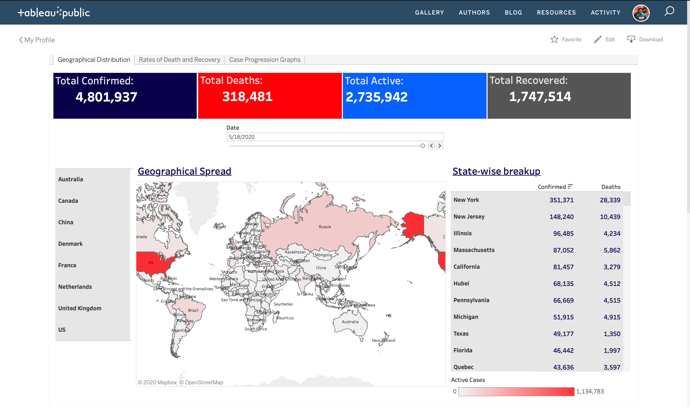

# [COVID-19-Real-time-Dashboard](https://public.tableau.com/profile/karan.rakesh.gupta#!/vizhome/COVID-19_15844231812360/GeographicalDistribution)

This Dashboard is created using Tableau Public, and the dataset used is provided by John Hopkins University.

A Data Pipeline is created in Python for extraction, transformation and loading of the data into Google Sheets, from where the data is fed to our Tableau Dashboard. The steps in which the entire pipeline is executed is as follows - 

1. Data Acquisition from Github
2. Data Transformation
3. Data Loading in Google Sheets using Google Sheets API
3. Data Visualization in Tableau Public using on demand, real time data from Google Sheets

The entire pipeline code can be viewed in the Python script - covid.py

## Data Acquisition from Github
The function - extract_data_from_url() is called in the etl() initiation function, to extract data from the provided URL.

Data is acquired from [here](https://github.com/CSSEGISandData/COVID-19/tree/master/csse_covid_19_data/csse_covid_19_time_series).

All csv files downloaded from this source, are stored in separate dataframes.

A total of 5 files are downloaded from this source - One for Confirmed Global Cases, one for Recovered Global Cases, one for global death cases, one for confirmed cases of USA (county-wise) and another for death cases of USA (county-wise).

## Data Transformation in Python
After extracting data from the respective csv's into disparate dataframes, the transform_dataframes_global() and transform_dataframes_usa() functions are called to transform the extracted data, so that it is ready to be fed to our dashboard.

The function - transform_dataframes_global() merges the 3 csv's for Confirmed, Recovered and Death cases into one after necessary modification.
The function - transform_dataframes_usa() merges data for USA and other countries for which state-level data is available, to create a new aggregated dataframe containing state-wise distribution of cases for available countries.

## Data Loading in Google Sheets using Google Sheets API
Since Tableau has an option of loading datasets from a Google Sheets Data Source, and allows for real time data refresh using this source, I have uploaded the transformed data to Google Sheets from Python, using the `pygsheets` library and Google Sheets API.

I first created a Project in [Google API Console](https://console.developers.google.com/) and enabled the Google Sheets and Google Drive API access for this project.

To access the Google Sheets API from our local Python console, we need to authorize pyghseets for this access.

This requires a credential to be created for our Google Console Project. Here's how you can create an appropriate credential:

1. Select ‘Credentials’ (under ‘Library’) from the left pane. This will display the ‘Credentials’ pane on the right
2. Click on the ‘CREATE CREDENTIALS’ option on the top. This will display a drop-down menu
3. Click on ‘Help me choose’ option from the drop-down menu, which will redirect you to a pane reading ‘Add credentials to your project’
4. On this pane follow along:

   1. Step 1: ‘Find out what kind of credentials you need’
      1. Which API are you using? — Google Sheets API
      2. Where will you be calling the API from? — Web server
      3. What data will you be accessing? — Application data
      4. Are you planning to use this API with App Engine or Compute Engine? — No, I’m not using them
      5. Now, click on ‘What credentials do I need?’ for suggestion as per our input

   2. Step 2: ‘Create a service account’
      1. Service account name — (for e.g: covid-data-update)
      2. Role — Editor (From drop-down select ‘Project’ and then ‘Editor’)
      3. Service account ID — auto-created
      4. Key type — JSON
      5. Now, click on ‘Continue’.
      6. This will ask you to save credentials.json file which allows access to your cloud resources — store it securely.

Now from this credentials file, I copied the email address value from ‘client_email’ key, and pasted this in the 'Share' options of a new Google Sheet, so that I can share that sheet (target sheet) with the client email. This email needs to be given edit access to the sheet.

Next I authorized `pygsheets` to make edits in the created Google Sheet with the below command - 

`client = pygsheets.authorize(service_file='/Users/karan7798z/Desktop/Data_Science/credentials.json')`

and the rest of the code in the covid.py file, ensures that the data is loaded in the Google Sheet upon execution.

The code also contains a section where you can add your own path, and at that path, a log file would be created in which all the steps involved in loading the dataframe to Google Sheets would be logged so as to be able to triage any issues that may arise in between. You need to add your own path in the covid.py file on line 41. Add your path in place of  - 

'/Users/karan7798z/Desktop/Data_Science/corona-virus-report/Logs/Log.txt'

## Data Visualization in Tableau Public, using real time data from Google Sheets
Now in Tableau Public, a Google Sheets Data Source is selected and after allowing it access to the Google account where the Google Sheet is loaded with data, it is given the path of our new Google Sheet.

I have attached my Tableau Workbook here for reference.

Finally, to **automate** the entire workflow, it is necessary to automate the execution of the python file - covid.py which acts as the controller for the entire project (since this file acquires data from the github source, transforms it, and loads it into Google Sheets).

I have scheduled a workflow in Apache Airflow for this, to execute this Python file everyday at 1.30 AM (since it is around that time that the Github repository containing our source file gets refreshed).
